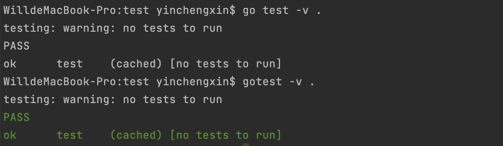
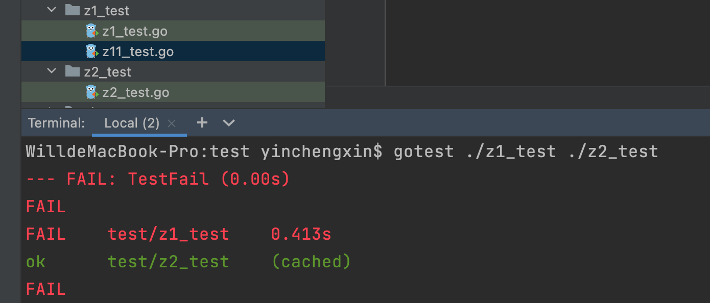
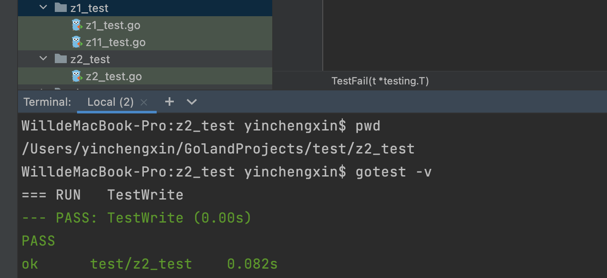
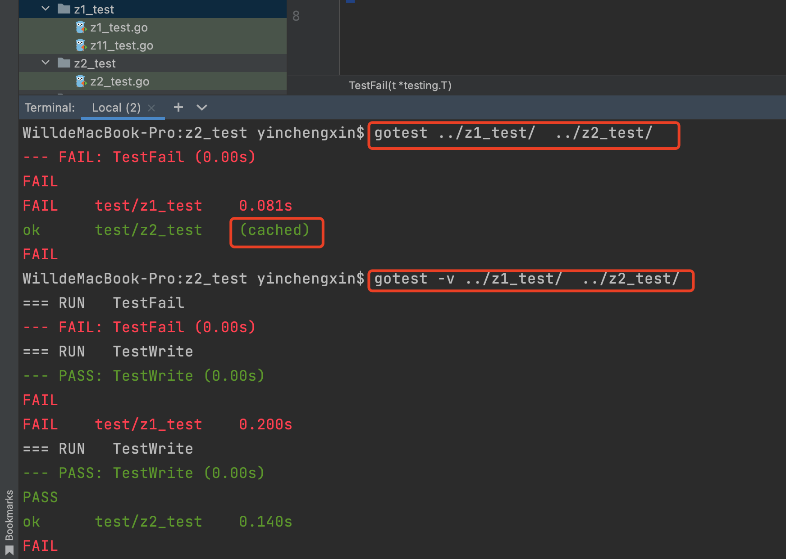
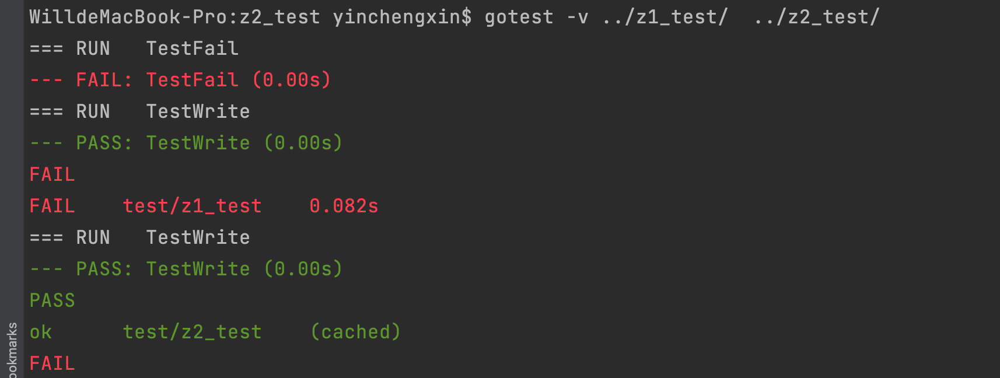
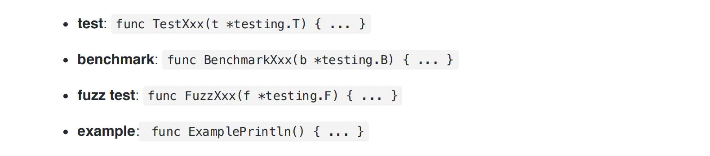
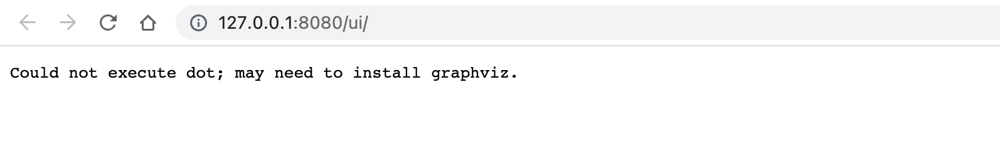
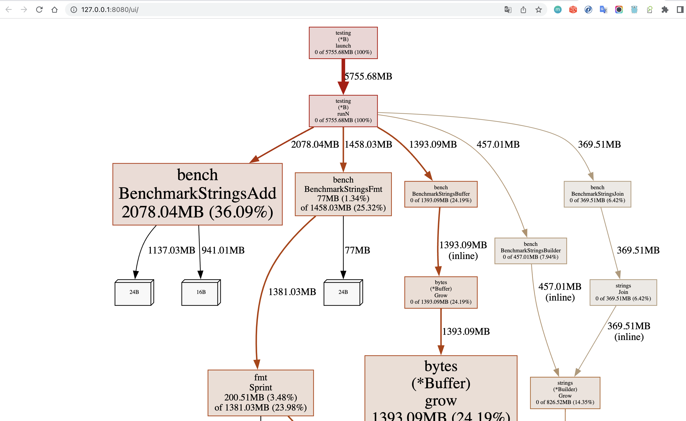
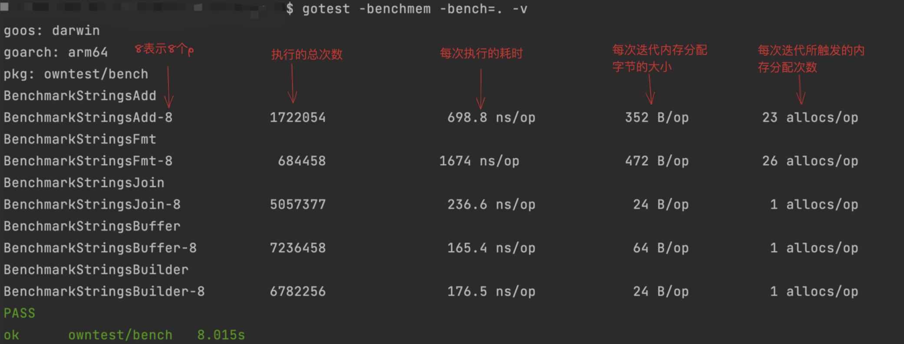
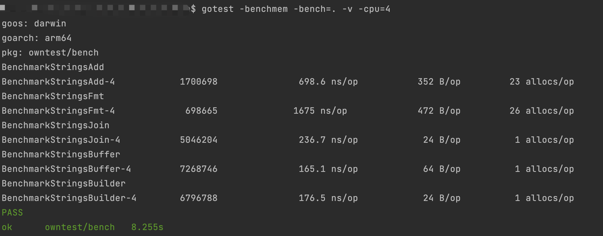

# [Go Test](http://cngolib.com/testing.html)

## 1. 基础语法

Go提供了test⼯具，可以对形式如  `func TestXxx(t *testing.T) `  格式的函数进⾏⾃动化单元测试，这样的函数我们称之为单元测试函数。 

函数名必须以 Test 开头，并且 Xxx 必须⾸字⺟⼤写，⽐如 Add 、 Do 等。⾸字⺟⼩写如 add 和 do 不被认为是单元测试函数， go test 不会⾃动执⾏。

⼀般  Xxx  我们常常使⽤要单元测试的函数名，或者是要单元测试的结构体( struct )名称。但是 也不是绝对的，只是⼤家习惯于这样写。

⼀般单元测试的名称我们还会命名为 TestXxx_Yyy 等形式，加⼀些后缀，⽤来区分⼀些⼦测试或 者不同场景的测试，这种命名没有强制规定，`但G官⽅标准库的单元测试名称更倾向使⽤多个单 词的⼤驼峰式命名法，如 TestAbcXyzWithIjk ,⽽不是以下划线分隔的⽅式`。

所有的单元测试函数都放在以 _test.go 结尾的⽂件中，此⽂件放在和要测试的⽂件相同的 package 中。

**Demo**

⽐如在包s1下定义了⼀个 greet 函数( hello.go ):

```go
package s1

func greet(s string) string {
  return "hello" + s
}
```

在相同的⽂件夹下创建⼀个 hello_test.go 的⽂件,然后实现⼀个单元测试的函数 (注意函数名称中的G需要⼤写，否则不会被认为是单元测试的函数) :

```go
package s1

import "testing"

func TestGreet(t *testing.T) {  // 这里传入的是 *testing.T 引用
  s := greet("test")
  if s != "hello test" {
  	t.Errorf("want 'hello test' but got %s", s)
  }
}
```

在此⽬录下执⾏   `go test -v .`    , 就可以看到此 package下(当前目录下) 所有的单元测试就会被执⾏了

**测试用例有四种形式：**

- TestXxxx(t *testing.T)				// 基本测试用例
- BenchmarkXxxx(b *testing.B)  // 压力测试的测试用例
- Example_ Xxx0                        // 测试控制台输出的例子
- TestMain(m *testing.M)             // 测试Main函数

### 1.1 更友好的测试结果显示

当⼀个项⽬下的单元测试⾮常多的时候，测试结果会刷屏，成功的测试和失败的测试混合在结果 中，不容易区分，所以有些开发者提供了定制的⼯具，对测试结果进⾏染⾊，让成功的结果和失 败的结果更容易区分出来。如果你以前使⽤过XUnit⻛格的测试⼯具，⽐如JUint,它会使⽤红绿颜⾊做区分

rakyll是⼀位知名的Gopher,她提供了⼀个⼯具rakyll/gotest,可以彩⾊化单元测试的结果。 你可以执⾏   

- `go install github.com/rakyll/gotest@latest `   

安装这个⼯具。先前我们进⾏单元 测试的时候敲⼊ go test ... ,使⽤这个⼯具的时候去掉空格就好了 `gotest`  ... 



### 1.2 testing.T 

Go单元测试的基本格式如下:

```go
func TestXxx(t *testing.T) {
  ....
}
```

**这个函数是没有返回类型的，⽽且必须有且只有⼀个 testing.T 的参数。**

*testing.T 和⽤来做benchmark的 testing.B 以及做模糊测试的 *testing.F ⼀样，都实现 了 testing.TB 接⼝。这个接⼝的名字也很有趣，应该先前是 T 、 B 共同的接⼝，所以叫 TB ,不 过后来Go 1.18加⼊了Fuzzing测试，所以接⼝名是不是应该是 TBF 了？不过这不重要，⼀般我们很少直接使⽤  `*testing.TB`

**标记测试是否失败 （Fail/FailNow/Failed/Fatal/Fatalf）**

- Fail: 标记当前测试失败，但是后续的代码还是继续执⾏，不会中断 
- FailNow: 标记当前测试失败，并且调⽤ runtime.Goexit 停⽌本goroutine的执⾏。 因为只是调⽤的 runtime.Goexit ,⽽不是 os.Exit ，所以它只是停⽌了本测试，后续的测试还是会被执⾏。 
- Fatal: 先输出⼀个⽇志(Log),再标记当前测试失败停⽌执⾏。等价于 Log + FailNow 。 
- Fatalf: 等价于 Logf + FailNow 。 
- Failed: 返回当前函数是否已经被标记为failed。

```go
package s2

import (
	"testing"
	"time"
)

func TestFail(t *testing.T) {
	t.Fail()
	t.Log("after Fail")
	t.FailNow()
	t.Log("after FailNow")
}
/*
=== RUN   TestFail
    main_test.go:11: after Fail
--- FAIL: TestFail (0.00s)

FAIL
*/


func TestFatal(t *testing.T) {
	t.Fatal("fataled")
	t.Log("after Fatal")
}
/*
=== RUN   TestFatal
    main_test.go:16: fataled
--- FAIL: TestFatal (0.00s)

FAIL
*/

func TestFatalf(t *testing.T) {
	t.Fatalf("there is: %v", "Fatalf")
	t.Log("after Fatalf")
}
/*
=== RUN   TestFatalf
    main_test.go:20: there is: Fatalf
--- FAIL: TestFatalf (0.00s)

FAIL
*/

func TestFailNowInAnotherGoroutine(t *testing.T) {
	go func() {
		t.FailNow()  // 调⽤ runtime.Goexit 停⽌本goroutine的执⾏
		t.Log("after FailNow in another goroutine")
	}()
	time.Sleep(time.Second)
	t.Log("after one second")
}
/*
=== RUN   TestFailNowInAnotherGoroutine
    main_test.go:30: after one second
--- FAIL: TestFailNowInAnotherGoroutine (1.00s)

FAIL
*/
```

**输出⽇志 (Log/Logf/Error/Errorf)**

- Log: 类似 Println ,输出到error log中。对于单元测试，只有测试失败或者使⽤ -test.v 参 数时，才会真正输出⽇志。但是对于benchmark,总是会输出。 
- Logf: 类似 Printf ,可以输出格式化的⽇志。 
- Error: 等价于 Log + Fail 。 
- Errorf: 等价于 Logf + Fail 。

```go
func TestLog(t *testing.T) {
	t.Log("it is a log")
	t.Logf("it is a log at %v", time.Now().Format(time.RFC1123))
	t.Error("it is an error")
	t.Errorf("it is an error at %v", time.Now().Format(time.RFC1123))
}
/*
=== RUN   TestLog
    main_test.go:10: it is a log
    main_test.go:11: it is a log at Wed, 04 Jan 2023 17:52:03 CST
    main_test.go:12: it is an error
    main_test.go:13: it is an error at Wed, 04 Jan 2023 17:52:03 CST
--- FAIL: TestLog (0.00s)
*/
```

**跳过（Skip/SkipNow/Skipped/equivalent）**

- SkipNow: 跳过本测试，并调⽤ runtime.Goexit 停⽌执⾏本测试。 
- Skip：等价于 Log + SkipNow 。 
- Skipf: 等价于 Logf + SkipNow 。
- Skipped: 返回当前测试是否被跳过。

```go
func TestSkip(t *testing.T) {
	if runtime.GOOS == "darwin" {
		t.Skip("skip MacOs")
	}
	if testing.Short() { //有些单元测试需要耗费⽐较⻓的时间。当传⼊ -short 参数时，我们就跳过这些耗时⻓的测试。
		t.Skip("skip because of short")
	}

	t.Log("there a non-skipped log")
}
/*
=== RUN   TestSkip
    main_test.go:12: skip MacOs
--- SKIP: TestSkip (0.00s)

Test ignored.
PASS
*/
```

**Parallel [ˈpærəlel] 并行的**

当⼀个单元测试的函数标记为可以并发执⾏的时候，它可以并且只能和其它标记为 `Parallel` 的函数 并发执⾏。 

当使⽤  `-test.count `  或  `-test.cpu`  参数时，同⼀个单元测试的多个实例之间不会并发执⾏

```go
func TestParallel(t *testing.T) {
	urls := map[string]string{"baidu": "http://baidu.com", "weibo": "https://weibo.com/"}
	for k, v := range urls {
		v := v
		ok := t.Run(k, func(t *testing.T) {
			t.Parallel()
			t.Logf("start to get %s", v)
			resp, err := http.Get(v)
			if err != nil {
				t.Fatalf("failed to get %s: %v", v, err)
			}
			resp.Body.Close()
		})
		t.Logf("run: %t", ok)
	}
}

/*
=== RUN   TestParallel
=== CONT  TestParallel
    main_test.go:25: run: true
=== CONT  TestParallel
    main_test.go:25: run: true
--- PASS: TestParallel (0.00s)
=== RUN   TestParallel/weibo
=== PAUSE TestParallel/weibo
=== CONT  TestParallel/weibo
    main_test.go:18: start to get https://weibo.com/
    --- PASS: TestParallel/weibo (0.48s)
=== RUN   TestParallel/baidu
=== PAUSE TestParallel/baidu
=== CONT  TestParallel/baidu
    main_test.go:18: start to get http://baidu.com
    --- PASS: TestParallel/baidu (0.09s)
PASS
*/
```

**Cleanup**

有时候我们写单元测试的时候，需要做⼀些准备的动作，⽐如建⽴与数据库的连接，打开⼀个⽂ 件、创建⼀个临时⽂件等等，执⾏案单元测试我们还想执⾏⼀些清理的动作，⽐如关闭与数据库 的连接，关闭⽂件，删除临时⽂件等等，这个时候我们就可以使⽤Cleanup⽅法了：

```go
func TestWrite(t *testing.T) {
	// 在目录dir中创建一个新的临时目录
	tmpDir, err := ioutil.TempDir(".", "tmp")
	if err != nil {
		t.Errorf("create tmpDir: %v", err)
	}
	t.Cleanup(func() { 
    os.RemoveAll(tmpDir) // 这里不执行 remove 则会生成一个临时的文件夹, 如: tmp2212224826/test.log
	})
	err = ioutil.WriteFile(filepath.Join(tmpDir, "test.log"), []byte("hello test"), 0644)
	if err != nil {
		t.Errorf("want write but got: %v", err)
	}
}
```

**TestMain**

Go还提供了TestMain的功能。 TestMain并不是⽤来测试main函数，⽽是对同⼀个package下的所 有测试有统⼀的控制。 

⽐如所有的测试都数据数据库的连接，那么可以在 m.Run 之前把数据库连接准备好，在执⾏完测 试之后把数据库关闭。

 你可以看到它和 Cleanup 不太⼀样， Cleanup 针对的是⼀个单元测试函数，⽽ TestMain 针对的 是同⼀个package所有的测试

```go
func TestMain(m *testing.M) {
	log.Println("do stuff BEFORE the tests!")
	exitVal := m.Run()
	log.Println("do stuff AFTER the tests!")
	os.Exit(exitVal)
}

func TestParallel(t *testing.T) {
	urls := map[string]string{"baidu": "http://baidu.com", "weibo": "https://weibo.com/"}
	for k, v := range urls {
		v := v
		ok := t.Run(k, func(t *testing.T) {
			t.Parallel()
			t.Logf("start to get %s", v)
			resp, err := http.Get(v)
			if err != nil {
				t.Fatalf("failed to get %s: %v", v, err)
			}
			resp.Body.Close()
		})
		t.Logf("run: %t", ok)
	}
}

/*
Will'sMacBook-Pro:$ go test -v .
2023/01/04 21:51:11 do stuff BEFORE the tests!

=== RUN   TestParallel
=== RUN   TestParallel/baidu
=== PAUSE TestParallel/baidu
=== CONT  TestParallel
    main_test.go:54: run: true
=== RUN   TestParallel/weibo
=== PAUSE TestParallel/weibo
=== CONT  TestParallel
    main_test.go:54: run: true
=== CONT  TestParallel/baidu
    main_test.go:47: start to get http://baidu.com
=== CONT  TestParallel/weibo
    main_test.go:47: start to get https://weibo.com/
--- PASS: TestParallel (0.00s)
    --- PASS: TestParallel/weibo (2.59s)
    --- PASS: TestParallel/baidu (3.33s)
    
2023/01/04 21:51:15 do stuff AFTER the tests!
*/
```

### 1.3 go test 命令

#### 1.3.1 go help test/build

这条命令主要介绍了 `go test` 基础的知识	⽐如 ` go test` 命令格式如下: 

````
go test [build/test flags] [packages] [build/test flags & test binary flags]
````

- build/test flags 的作用可以通过执行  `go help test/build`  查看详细信息, 这些是编译运行过程中需要使用到的参数，一般设置为空, 值得注意的是, **我们可以设置 build/test flags 参数，可以放在包的前⾯和后⾯。 既⽀持test的参数，还⽀持build参数，⽐如 -N -l 禁⽌优化和内联**。

- 可以看到 packages 是复数，也就意味着我们可以测试⼀组package,传⼊package列表即可，⽐ 如 go test testOne testTwo , 如果有失败的测试，会把错误信息细节显示出来。

  ```go
  package z1_test
  
  import (
  	"io/ioutil"
  	"os"
  	"path/filepath"
  	"testing"
  )
  
  func TestFail(t *testing.T) {
  	t.Fail()
  }
  
  func TestWrite(t *testing.T) {
  	// 在目录dir中创建一个新的临时目录
  	tmpDir, err := ioutil.TempDir(".", "tmp")
  	if err != nil {
  		t.Errorf("create tmpDir: %v", err)
  	}
  	t.Cleanup(func() {
  		os.RemoveAll(tmpDir)
  	})
  	err = ioutil.WriteFile(filepath.Join(tmpDir, "test.log"), []byte("hello test"), 0644)
  	if err != nil {
  		t.Errorf("want write but got: %v", err)
  	}
  }
  
  // ------------------------------------------------------------------------------------------------
  
  package z2_test
  
  import (
  	"io/ioutil"
  	"os"
  	"path/filepath"
  	"testing"
  )
  
  func TestWrite(t *testing.T) {
  	// 在目录dir中创建一个新的临时目录
  	tmpDir, err := ioutil.TempDir(".", "tmp")
  	if err != nil {
  		t.Errorf("create tmpDir: %v", err)
  	}
  	t.Cleanup(func() {
  		os.RemoveAll(tmpDir)
  	})
  	err = ioutil.WriteFile(filepath.Join(tmpDir, "test.log"), []byte("hello test"), 0644)
  	if err != nil {
  		t.Errorf("want write but got: %v", err)
  	}
  }
  
  /*
    $ gotest ./z1_test ./z2_test
    --- FAIL: TestFail (0.00s)
    FAIL
    FAIL    test/z1_test    0.413s
    ok      test/z2_test    (cached)
    FAIL
  */
  ```

  

**go test 可以使⽤两种模式运⾏：**

- **本地⽂件夹模式**

  在这种模式下， 不指定 packages 参数, 它只编译本地⽂件夹的代码和测试(当前目录)。 **在这种模式下，缓存是被禁⽌的**，所以每次执⾏总会重新编译。 最后会显示测试的状态( ok 或者 FAIL ),包名和耗时。 ⽐如 `go test -v` 、 `go test -run TestAbc` 都是这种模式

  

- **包列表模式**

  在这种模式下，需要显示指定包名或者包列表。包名的形式有很多种，你可以执⾏  `go help packages`  查看包名的格式。 在这种模式下， go test 会编译和执⾏每⼀个包的代码和测试。 如果 package 单测都通过，它仅仅只会输出 ok 信息。如果失败，会输出所有的细节。如果设置了 -bench 或者 -v , 就会显示所有的输出, 如果任意⼀个package没有通过单测，最后会输出⼀个 FAIL （例如 `go test pkgName`，`gotest./plgName1/pkgName2`   甚至是  `go test . `）

  

  

  **在包列表模式下， go test 会缓存已经成功通过单测的package测试结果，避免不必要的重复测试，它会把缓存的结果显示出来，同时加上 cached 标记**

  缓存中匹配的规则是，运⾏涉及相同的 test ⼆进制⽂件，命令⾏上的标志完全来⾃⼀组受限制的 「cachebale」 测试标志，⽐如             `-benchtime` 、 `-cpu `、 `-list` 、 `-parallel` 、 `-run` 、 `- short` 、 `-timeout` 、 `-failfast` 和 `-v` 。如果运⾏ go test 时有此集之外的任何测试或⾮测试标志，则不会缓存结果。若要禁⽤测试缓存，请使⽤除 「cacheable」 标志以外的任何测试标志或参数

  显式禁⽤测试缓存的⽅法是使⽤ `-count=1`  

  **`go clean --testcache` 会清除所有 cached 的单元测试**

#### 1.3.2 go help testflag

执⾏ `go help testflag` 可以查看 go test ⽀持的 test flag。有些是和 benchmark 相关，有些和 fuzz 相关

```
-count n
  运⾏ test、benchamrk、fuzz 多少次。默认⼀次。
  如果指定了 -cpu，那就是在每个 GOMAXPROCS 上执⾏ n 次。
  Example 只会运⾏⼀次。使⽤ -fuzz 时 -count 对 fuzz test 不起作⽤。
  例子: gotest -v ../z2_test/  -count=2
  
-cover
  允许代码覆盖率分析。
  例子: gotest -v ../z2_test/  -cover
  
-covermode set,count,atomic
  设置代码覆盖率的模式。默认模式是set, 除⾮ -race 启⽤。-race 启⽤下模式为 atomic。
  set: bool: 此语句是否运⾏？
  count: int: 此语句要执⾏多少次？
  atomic: int: 类似count, 但是在多线程环境下正确，花费更⾼、
  
-coverpkg pattern1,pattern2,pattern3
	只对模式匹配的包进⾏代码覆盖率分析。
	
-cpu 1,2,4
	为每⼀个测试指定GOMAXPROCS列表。默认值是当前的GOMAXPROCS。
	
-failfast
	第⼀个测试失败后并不启动新的单元测试。
	例子: gotest -v ../z1_test/  -failfast
	
-json
	以JSOn格式输出。
	例子: gotest -v ../z1_test/  -json
	
-list regexp
	输出test、benchmark、fuzz test、example列表。
	
-parallel n
	允许并发执⾏设置了t.Parallel的test函数和fuzz targets。
	例子: gotest -v -parallel=3
	
-run regexp
  只运⾏匹配的test、example、fuzz test。
  For tests, the regular expression is split by unbracketed
  正则表达式如果有斜杠 (/) ,那么它匹配⼦测试。⽐如-run=X/Y 匹配所有X下⽆⼦测试
  以及X下⼦测试匹配Y的测试。
  
-short
	告诉⻓时间允许的测试缩短它们的测试时间。
	
-shuffle off,on,N
	随机化执⾏测试和benchmark。默认禁⽤。
	
-timeout d
  如果⼀个测试运⾏超过d,就会panic。
  如果d设置为0, timeout参数会被禁⽤。默认10分钟。
  
-v
	开启详细输出。
	
-vet list
	配置go test运⾏是go vet的检查项。
	
-coverprofile cover.out
	将代码覆盖率写⼊到⼀个⽂件中。
```

下⾯的参数是和 profile 相关：

```
-benchmem
	为benchmark输出内存分配统计。
	
-blockprofile block.out
	输出goroutine blocking profile到指定的⽂件。
	
-blockprofilerate n
	控制goroutine blocking profile细节，调⽤runtime.SetBlockProfileRate。
	
-cpuprofile cpu.out
	写CPU profile到⼀个指定的⽂件。
	
-memprofile mem.out
	写allocation profile到⼀个指定的⽂件。
	
-memprofilerate n
	允许更精准的memory allocation profile,通过设置runtime.MemProfileRate。
	
-mutexprofile mutex.out
	写mutex contention profile 到指定的⽂件。
	
-mutexprofilefraction n
	在n个goroutine持有竞争锁的stack trace采样。
	
-outputdir directory
	profile输出⽂件的⽬录，默认go test运⾏的⽬录。
	
-trace trace.out
	写execution trace 信息到指定的⽂件。
```

#### 1.3.3 go help testfunc



### 1.4 代码覆盖率

代码覆盖率，也称为测试覆盖率，可衡量⾃动化测试执⾏的代码⽐例

代码覆盖率⼯具针对特定的编程语⾔。 其使⽤⼀系列标准衡量覆盖率，包括代码⾏数、⽅法或函数、分⽀和条件

监测代码覆盖率指标有助于确保保持⾜够的⾃动化测试⽔平。 如果代码覆盖率有所下降，则可能表明没有将⾃动化测试作为编写新代码的核⼼要素。

**前面在提及 `testflag` 的时候, 我们提到了几个 flag**

- -cover: 开启代码覆盖率分析 
- -covermode: 分析代码覆盖率模式。 这个模式的不同的设置，会影响统计的结果。⽐如 set, 只是统计代码是否被覆盖。count 还是统计代码⾏覆盖的数量，atomic 针对并发测试的统计。 
- -coverpkg: 分析指定的package。指定coverpkg好处是它能够跨package统计代码覆盖率, 这篇⽂章 [Get Accurate Code Coverage in Go ](https://www.ory.sh/golang-go-code-coverage-accurate/)做了详细的测试。最好这个设置成 - coverpkg=./... ⽽不是 -coverpkg=all 。

语法

```
go test  ./z1_test/ -coverprofile=coverage.out

go tool cover -func=coverage.out

go tool cover -html=coverage.out
```

**⽣成更漂亮的测试报告**

[matm/gocov-html](https://github.com/matm/gocov-html)  提供了⼀种⽣成junit⻛格的代码覆盖率的⽅法。它使⽤ [axw/gocov](https://github.com/axw/gocov) ⼯具⽣成的测 试结果，转换成 junit⻛格的⽹⻚。当然 gocov 也能把 go cover ⽣成的测试结果转换成它的格式。

**⽣成treemap图** 

为了看⼀个项⽬的整体的代码状况，可以使⽤ [nikolaydubina/go-cover-treemap](https://github.com/nikolaydubina/go-cover-treemap) ,它可以⽣成漂 亮的 SVG treeamap 图，如上⾯的grpc的代码覆盖率图。 只需要三步就可以⽣成相应的图。 

- 安装go-cover-treemap⼯具 

- 使⽤go test⽣成代码覆盖率数据 

- 转换数据为svg treemap图 

  ```shell
  $ go install github.com/nikolaydubina/go-cover-treemap@latest
  
  $ go test -coverprofile cover.out ./...
  
  $ go-cover-treemap -coverprofile cover.out > out.svg
  ```

## 2. 第三方工具库

### 2.1 [stretchr/testify](https://github.com/stretchr/testify)

其中最常见的两个包就是 [assert 包和 require 包](https://pkg.go.dev/github.com/stretchr/testify@v1.8.0/assert), assert 类似 Fail, 断⾔失败不会导致此测试停⽌，后续的逻辑还是会继续执⾏, require 类似 Fatal,⼀旦测试失败，此测试就会结束

```go
package owntest

import (
	"github.com/stretchr/testify/assert"
	"github.com/stretchr/testify/require"
	"testing"
)

func TestAssert(t *testing.T) {
	// 断⾔两个值相等，否则就失败,并输出提示⽂本
	assert.Equal(t, 123, 123, "they should be equal")
	// 断⾔不相等
	assert.NotEqual(t, 123, 456, "they should not be equal")
	// 断⾔object是nil值
	assert.Nil(t, nil)
	// 断⾔object⾮nil
	if assert.NotNil(t, "not nil") {
		// 断⾔object.Value和某值相等
		assert.Equal(t, "not nil", "not nil")
	}
}

func TestRequire(t *testing.T) 
	// 断⾔两个值相等，否则就失败,并输出提示⽂本
	require.Equal(t, 123, 123, "they should be equal")

	// 断⾔不相等
	require.NotEqual(t, 123, 456, "they should not be equal")
	// 断⾔object是nil值
	require.Nil(t, nil)
}
```

**什么时候⽤ assert 什么时候⽤ require ?** 

> 在处理必要的测试结果⽤require,⽐如数据库的连接，如果 连接没有建⽴，那么后续的测试也没有必要测试了，所以此时适合⽤require。

### 2.2 [google/go-cmp](https://github.com/google/go-cmp)

如果你使⽤go标准库的⽅法，判断两个值是否相等并显示值的不同时，如果值的类似是复杂的 struct类型，你并不容易把两个值的不同区分出来并显示

```go
package owntest

import (
	"fmt"
	"github.com/google/go-cmp/cmp"
	"net"
	"testing"
	"time"
)

type (
	Gateway struct {
		SSID      string
		IPAddress net.IP
		NetMask   net.IPMask
		Clients   []Client
	}
	Client struct {
		Hostname  string
		IPAddress net.IP
		LastSeen  time.Time
	}
)

func MakeGatewayInfo() (x, y Gateway) {
	x = Gateway{
		SSID:      "CoffeeShopWiFi",
		IPAddress: net.IPv4(192, 168, 0, 1),
		NetMask:   net.IPv4Mask(255, 255, 0, 0),
		Clients: []Client{{
			Hostname:  "ristretto",
			IPAddress: net.IPv4(192, 168, 0, 116),
		}, {
			Hostname:  "aribica",
			IPAddress: net.IPv4(192, 168, 0, 104),
			LastSeen: time.Date(2009, time.November, 10, 23, 6, 32, 0,
				time.UTC),
		}, {
			Hostname:  "macchiato",
			IPAddress: net.IPv4(192, 168, 0, 153),
			LastSeen: time.Date(2009, time.November, 10, 23, 39, 43, 0,
				time.UTC),
		}, {
			Hostname:  "espresso",
			IPAddress: net.IPv4(192, 168, 0, 121),
		}, {
			Hostname:  "latte",
			IPAddress: net.IPv4(192, 168, 0, 219),
			LastSeen: time.Date(2009, time.November, 10, 23, 0, 23, 0,
				time.UTC),
		}, {
			Hostname:  "americano",
			IPAddress: net.IPv4(192, 168, 0, 188),
			LastSeen: time.Date(2009, time.November, 10, 23, 3, 5, 0,
				time.UTC),
		}},
	}
	y = Gateway{
		SSID:      "CoffeeShopWiFi",
		IPAddress: net.IPv4(192, 168, 0, 2),
		NetMask:   net.IPv4Mask(255, 255, 0, 0),
		Clients: []Client{{
			Hostname:  "ristretto",
			IPAddress: net.IPv4(192, 168, 0, 116),
		}, {
			Hostname:  "aribica",
			IPAddress: net.IPv4(192, 168, 0, 104),
			LastSeen: time.Date(2009, time.November, 10, 23, 6, 32, 0,
				time.UTC),
		}, {
			Hostname:  "macchiato",
			IPAddress: net.IPv4(192, 168, 0, 153),
			LastSeen: time.Date(2009, time.November, 10, 23, 39, 43, 0,
				time.UTC),
		}, {
			Hostname:  "espresso",
			IPAddress: net.IPv4(192, 168, 0, 121),
		}, {
			Hostname:  "latte",
			IPAddress: net.IPv4(192, 168, 0, 221),
			LastSeen: time.Date(2009, time.November, 10, 23, 0, 23, 0,
				time.UTC),
		}},
	}
	return x, y
}

var t fakeT

type fakeT struct{}

func (t fakeT) Errorf(format string, args ...interface{}) {
	fmt.Printf(format+"\n", args...)
}

func TestCMP(t *testing.T) {
	got, want := MakeGatewayInfo()
	if diff := cmp.Diff(want, got); diff != "" {
		t.Errorf("MakeGatewayInfo() mismatch (-want +got):\n%s", diff)
	}
}

/*
输出结果:
MakeGatewayInfo() mismatch (-want +got):
cmp_test.Gateway{
  SSID: "CoffeeShopWiFi",
  - IPAddress: s"192.168.0.2",
  + IPAddress: s"192.168.0.1",
  NetMask: s"ffff0000",
  Clients: []cmp_test.Client{
  ... // 2 identical elements
  {Hostname: "macchiato", IPAddress: s"192.168.0.153", LastSeen:
  s"2009-11-10 23:39:43 +0000 UTC"},
  {Hostname: "espresso", IPAddress: s"192.168.0.121"},
  {
    Hostname: "latte",
    - IPAddress: s"192.168.0.221",
    + IPAddress: s"192.168.0.219",
    LastSeen: s"2009-11-10 23:00:23 +0000 UTC",
  },
  + {
    + Hostname: "americano",
    + IPAddress: s"192.168.0.188",
    + LastSeen: s"2009-11-10 23:03:05 +0000 UTC",
    + },
  },
}
*/
```

## 3. Mock、容器及Monkey Patching

在当今⼤型的Go应⽤程序中，整体的架构都会⽐较复杂，从程序本身来讲，它可能会依赖很多的 基础服务，⽐如数据库存储mysql等、缓存系统redis等，其它的⼀些基础服务⽐如Prometheus 等，程序的业务逻辑会访问这些基础服务。

同时，微服务架构额流⾏，也导致⼀个产品会划分成多个微服务，每个微服务只专注于⾃⼰的业 务，服务之间通过restful的 API或者RPC框架或者其它⽅式进⾏通讯。 这就给测试带来了很⼤的困难,本来，我们要测试的是很⼩的⼀段代码逻辑，⽐如某个类型的⼀个 ⽅法，但是由于⽅法体中依赖基础服务或者其它的微服务，这些基础服务和其它的微服务都是线 上的服务，没有办法集成测试，即使搭建了线上的环境，也可能因为我们的开发机的环境由于安 全等原因，也没有办法直接访问这些服务，导致没有办法执⾏单元测试。 另外如果我们在开发代码的时候，⼀开始并没有从易于单元测试的⻆度去开率设计⽅法实现，导 致很难进⾏单元测试，⽐如实现某个⽅法的时候，把所有的逻辑都写在⼀个⽅法实现中:

```go
func (s *S) AMethod() {
  读取⼀些配置
  建⽴数据库的连接
  访问数据库
  执⾏⼀些业务逻辑
  访问第三⽅的微服务
  访问redis缓存
  执⾏⼀些业务逻辑
  调⽤另⼀个微服务
  返回
}
```

⼀些代码规范或者最佳实践会告诉你，每⼀个函数和⽅法的实现应该保持尽量的⼩，它们只执⾏ 单⼀的业务逻辑。**⾯向对象编程五⼤原则之⼀就是单⼀职责原则：⼀个类或者⼀个函数应该只负 责程序中的单⼀逻辑部分**。⽐如上⾯的代码，如果拆分成多个⽅法，⼀个⽅法的返回值可以是另 外⼀个⽅法的输⼊参数，这样我们在实现这些⽅法的单元测试时，就可以mock这些参数，针对这 些⽅法进⾏测试 

Mock的⽅式有很多，你可以⾃⼰写⼀些Mock对象，也可以使⽤第三⽅的mock库

### 3.1 [google/mock](https://github.com/golang/mock)

安装: 

````
go install github.com/golang/mock/mockgen@latest
````

**⽐如你可以为标准库的 *io.Writer, io.Reader* ⽣成 Mock 对象，不必关⼼⾃动⽣成的 Mock 对象，⽽是直接使⽤它们即可。**

```
mockgen -destination io_test.go io Reader,Writer

# 可能会报出缺少依赖的问题
go get github.com/golang/mock/mockgen/model
```

重要的你可以实现 *Controler mock* 相应的对象

```go
// Code generated by MockGen. DO NOT EDIT.
// Source: io (interfaces: Reader,Writer)

// Package mock_io is a generated GoMock package.
package owntest

import (
	"github.com/stretchr/testify/assert"
	reflect "reflect"
	"testing"

	gomock "github.com/golang/mock/gomock"
)

// TestReader my test
func TestReader(t *testing.T) {
	ctrl := gomock.NewController(t)
	defer ctrl.Finish()
	r := NewMockReader(ctrl)
	r.EXPECT().Read(gomock.All()).Do(func(arg0 []byte) {
		for i := 0; i < 10; i++ {
			arg0[i] = 'a' + byte(i)
		}
	}).Return(10, nil).AnyTimes()
	data := make([]byte, 1024)
	n, err := r.Read(data)
	assert.NoError(t, err)
	assert.Equal(t, 10, n)
	assert.Equal(t, "abcdefghij", string(data[:n]))
}

// MockReader is a mock of Reader interface.
type MockReader struct {
	ctrl     *gomock.Controller
	recorder *MockReaderMockRecorder
}

// MockReaderMockRecorder is the mock recorder for MockReader.
type MockReaderMockRecorder struct {
	mock *MockReader
}

// NewMockReader creates a new mock instance.
func NewMockReader(ctrl *gomock.Controller) *MockReader {
	mock := &MockReader{ctrl: ctrl}
	mock.recorder = &MockReaderMockRecorder{mock}
	return mock
}

// EXPECT returns an object that allows the caller to indicate expected use.
func (m *MockReader) EXPECT() *MockReaderMockRecorder {
	return m.recorder
}

// Read mocks base method.
func (m *MockReader) Read(arg0 []byte) (int, error) {
	m.ctrl.T.Helper()
	ret := m.ctrl.Call(m, "Read", arg0)
	ret0, _ := ret[0].(int)
	ret1, _ := ret[1].(error)
	return ret0, ret1
}

// Read indicates an expected call of Read.
func (mr *MockReaderMockRecorder) Read(arg0 interface{}) *gomock.Call {
	mr.mock.ctrl.T.Helper()
	return mr.mock.ctrl.RecordCallWithMethodType(mr.mock, "Read", reflect.TypeOf((*MockReader)(nil).Read), arg0)
}

// MockWriter is a mock of Writer interface.
type MockWriter struct {
	ctrl     *gomock.Controller
	recorder *MockWriterMockRecorder
}

// MockWriterMockRecorder is the mock recorder for MockWriter.
type MockWriterMockRecorder struct {
	mock *MockWriter
}

// NewMockWriter creates a new mock instance.
func NewMockWriter(ctrl *gomock.Controller) *MockWriter {
	mock := &MockWriter{ctrl: ctrl}
	mock.recorder = &MockWriterMockRecorder{mock}
	return mock
}

// EXPECT returns an object that allows the caller to indicate expected use.
func (m *MockWriter) EXPECT() *MockWriterMockRecorder {
	return m.recorder
}

// Write mocks base method.
func (m *MockWriter) Write(arg0 []byte) (int, error) {
	m.ctrl.T.Helper()
	ret := m.ctrl.Call(m, "Write", arg0)
	ret0, _ := ret[0].(int)
	ret1, _ := ret[1].(error)
	return ret0, ret1
}

// Write indicates an expected call of Write.
func (mr *MockWriterMockRecorder) Write(arg0 interface{}) *gomock.Call {
	mr.mock.ctrl.T.Helper()
	return mr.mock.ctrl.RecordCallWithMethodType(mr.mock, "Write", reflect.TypeOf((*MockWriter)(nil).Write), arg0)
}
```

### 3.2 [DATA-DOG/go-sqlmock](https://github.com/DATA-DOG/go-sqlmock)

我们很多的应⽤都是和·数据库访问相关的，测试和数据库相关函数时就相当的痛苦。有时候我们 使⽤sqlite3这样的嵌⼊式数据库来作为集成数据库测试，但是我们也可以mock数据库对象。 datadog就提供了这样⼀个⾮常好⽤的库：DATA-DOG/go-sqlmock: Sql mock driver for golang to test database interactions。 

假定你使⽤ go-sql-driver/mysql 提供数据库访问的功能, recordStats 提供了数据

```go
package owntest

import (
	"database/sql"
	"fmt"
	"github.com/DATA-DOG/go-sqlmock"
	_ "github.com/go-sql-driver/mysql"
	"testing"
)

// 我们就可以使⽤个 go-sqlmock 来进⾏正⾯测试和负⾯测试:

// 成功的单测
func TestShouldUpdateStats(t *testing.T) {
	db, mock, err := sqlmock.New()
	if err != nil {
		t.Fatalf("an error '%s' was not expected when opening a stub database connection", err)
	}
	defer db.Close()
	mock.ExpectBegin()
	mock.ExpectExec("UPDATE products").WillReturnResult(sqlmock.NewResult(1, 1))                            // 执⾏update ...的时候返回值
	mock.ExpectExec("INSERT INTO product_viewers").WithArgs(2, 3).WillReturnResult(sqlmock.NewResult(1, 1)) // 执⾏insert ...的返回值
	mock.ExpectCommit()
	// now we execute our method
	if err = recordStats(db, 2, 3); err != nil {
		t.Errorf("error was not expected while updating stats: %s", err)
	}
	// we make sure that all expectations were met
	if err := mock.ExpectationsWereMet(); err != nil {
		t.Errorf("there were unfulfilled expectations: %s", err)
	}
}

// 失败的单测
func TestShouldRollbackStatUpdatesOnFailure(t *testing.T) {
	db, mock, err := sqlmock.New()
	if err != nil {
		t.Fatalf("an error '%s' was not expected when opening a stub database connection", err)
	}
	defer db.Close()
	mock.ExpectBegin()
	mock.ExpectExec("UPDATE products").WillReturnResult(sqlmock.NewResult(1, 1))
	mock.ExpectExec("INSERT INTO product_viewers").
		WithArgs(2, 3).
		WillReturnError(fmt.Errorf("some error")) // 返回错误
	mock.ExpectRollback()
	// now we execute our method
	if err = recordStats(db, 2, 3); err == nil {
		t.Errorf("was expecting an error, but there was none")
	}
	// we make sure that all expectations were met
	if err := mock.ExpectationsWereMet(); err != nil {
		t.Errorf("there were unfulfilled expectations: %s", err)
	}
}

func recordStats(db *sql.DB, userID, productID int64) (err error) {
	tx, err := db.Begin()
	if err != nil {
		return
	}
	defer func() {
		switch err {
		case nil:
			err = tx.Commit()
		default:
			tx.Rollback()
		}
	}()
	if _, err = tx.Exec("UPDATE products SET views = views + 1"); err != nil {
		return
	}
	if _, err = tx.Exec("INSERT INTO product_viewers (user_id, product_id) VALUES (?, ?)", userID, productID); err != nil {
		return
	}
	return
}
func main() {
	// @NOTE: the real connection is not required for tests
	db, err := sql.Open("mysql", "root@/blog")
	if err != nil {
		panic(err)
	}
	defer db.Close()
	if err = recordStats(db, 1 /*some user id*/, 5 /*some product id*/); err !=
		nil {
		panic(err)
	}
}
```

### 3.3 [HttpTest](https://pkg.go.dev/net/http/httptest)

Go标准库httptest提供了测试handler和模拟http server的⽅法。

我们会使⽤Go的http包写⼀些web应⽤程序，我们会实现⼀些handler,测试这些handler其实很⽅便,使⽤httptest.NewRecorder就可以模拟⼀个http.ResponseWriter:

```go
package owntest

import (
	"fmt"
	"io"
	"log"
	"net/http"
	"net/http/httptest"
	"testing"
)

func TestHandler(t *testing.T) {
	handler := func(w http.ResponseWriter, r *http.Request) {
		io.WriteString(w, "<html><body>Hello World!</body></html>")
	}
	req := httptest.NewRequest("GET", "http://example.com/foo", nil)
	w := httptest.NewRecorder()
	handler(w, req)
	resp := w.Result()
	body, _ := io.ReadAll(resp.Body)
	fmt.Println(resp.StatusCode)
	fmt.Println(resp.Header.Get("Content-Type"))
	fmt.Println(string(body))
}

func TestHttpServer(t *testing.T) {
	ts := httptest.NewUnstartedServer(http.HandlerFunc(func(w http.ResponseWriter, r *http.Request) {
		fmt.Fprintf(w, "Hello, %s", r.Proto)
	}))
	ts.EnableHTTP2 = true
	ts.StartTLS()
	defer ts.Close()
	res, err := ts.Client().Get(ts.URL)
	if err != nil {
		log.Fatal(err)
	}
	greeting, err := io.ReadAll(res.Body)
	res.Body.Close()
	if err != nil {
		log.Fatal(err)
	}
	fmt.Printf("%s", greeting)
}
```

当然还有⼀些其它的mock库，如果有需要，你也可以快速评估⼀下，看看能否应⽤到你的单元测 试中，为你的单元测试提供便利： 

- [https://github.com/h2non/gock](https://github.com/h2non/gock)
- [GitHub - gavv/httpexpect: End-to-end HTTP and REST API testing for Go](https://github.com/gavv/httpexpect). 
- [GitHub - steinfletcher/apitest: A simple and extensible behavioural testing library for Go. You can use api test to simplify REST API, HTTP handler and e2e tests](https://github.com/steinfletcher/apitest). 
- [GitHub - carlmjohnson/be: Generic testing helper for Go](https://github.com/carlmjohnson/be) 
- [GitHub - jfilipczyk/gomatch: Library created for testing JSON against patterns](https://github.com/jfilipczyk/gomatch)

### 3.4 容器化服务

虽然mock能够解决⼀部分的单元测试的痛点，但是 **mock 库⼀般要求mock的对象是接⼝**，**你的函 数的输⼊参数类型也得要求是接⼝类型，这会将⼤部分的业务函数和⽅法排除在外**。另外写这些 mock对象有时候也⾮常麻烦，没有直接的集成测试⽅便，所以⽬前有⼏个库，提供了集成容器测试的功能，那么依赖的基础服务，⽐如 redis、mysql、kafka 等，在测试额时候启动这些容器，测试完毕后再删除这些容器。

**使⽤这些容器的时候，要求你的docker要运⾏着，因为这些库会和 *docker* 服务交互，拉去镜像、 启动容器、停⽌容器和删除容器。** 

为了减少测试的时间，你最好先把这些镜像⼿⼯下载下来。 

当然你不使⽤这些库，你也可以⼿⼯启动容器配合测试。使⽤这些库的好处是⾃动化，⽐如⾃动 化在kafka上创建 topic、测试完毕后⾃动删除容器

#### 3.4.1 [arikamalgo-mysql-test-container](https://github.com/arikama/go-mysql-test-container)

go-mysql-test-container是⼀个专⻔⽤来集成mysql的库。 因为只针对集成mysql,所以它使⽤起来也⾮常的简单:

```go
package owntest

import (
	"github.com/arikama/go-mysql-test-container/mysqltestcontainer"
	"github.com/containerd/containerd/log"
	"testing"
)

func TestMySQL(t *testing.T) {
	mySql, _ := mysqltestcontainer.Create("test")
	db := mySql.GetDb()
	err := db.Ping()
	if err != nil {
		log.L.Errorln(err.Error())
	}
}


func TestRedis(t *testing.T) {
	ctx := context.Background()
	req := testcontainers.ContainerRequest{
		Image:        "redis:latest",
		ExposedPorts: []string{"6379/tcp"},
		WaitingFor:   wait.ForLog("Ready to accept connections"),
	}
	redisC, err := testcontainers.GenericContainer(ctx,
		testcontainers.GenericContainerRequest{
			ContainerRequest: req,
			Started:          true,
		})
	if err != nil {
		t.Error(err)
	}
	defer redisC.Terminate(ctx)
	rdb := redis.NewClient(&redis.Options{
		Addr:     "localhost:6379",
		Password: "", // no password set
		DB:       0,  // use default DB
	})
	err = rdb.Set("key", "value", 0).Err()
	assert.NoError(t, err)
	val, err := rdb.Get("key").Result()
	assert.NoError(t, err)
	assert.Equal(t, "value", val)
}
```

事实上上⾯的go-mysql-test-container底层使⽤的是testcontainers/testcontainers-go)库，只不过 对mysql的集成做了进⼀步的封装。

### 3.5 monkey/gomonkey

Mock⽅式使⽤起来有很多的限制，容器化的⽅式⼜依赖docker环境，测试也很慢，只能集成通⽤ 的基础服务, 那我们就在想, 能不能有一种更好的方式来进行测试呢

这⾥就不得不提到  [**bouk/monkey**](https://github.com/bouk/monkey) ，这个库可以说是开创了⼀个运⾏时修改函数的⻔派，好⼏个库 都是基于他的思想去实现的，尽管后来的库有各种⽅法和提供遍历的⼿段，但是核⼼思想还是受 到 boulk/monkey 的影响。

但是这个库目前已被归档, 因为各种特殊原因

```
Copyright Bouke van der Bijl
I do not give anyone permissions to use this tool for any purpose. Don't use it.
I’m not interested in changing this license. Please don’t ask.
```

但是一山更比一山高, [agiledragon/gomonkey](https://github.com/agiledragon/gomonkey) 出现了, 具体使用详情自行了解

## 4. web 程序单元测试实战

这里我们演示比较通用的 web 架构的测试方式

- model: 数据模型， 定义了Book类型和Author，只是类型的定义，并没有业务逻辑，不需要 单元测试 
- dao: 提供数据库的访问。作为例⼦这⾥提供了⼀个 InsertBook 的实现，往数据库中插⼊⼀ 条书籍的信息 
- service：提供CreateBook⽅法，实际可以检查书籍是否存在，作者是否存在等逻辑判断，如 果满⾜则调⽤dao的函数插⼊⼀条书籍信息 
- api：也叫controller,提供CreateBook handler,检查request的参数，如果满⾜则调⽤service层 创建书籍

### 4.1 DAO 层测试

本次我们使用 sqlmock 的⽅式提供测试，不依赖任何数据库或者容器

```go
package owntest

import (
	"context"
	"database/sql"
	"github.com/DATA-DOG/go-sqlmock"
	"github.com/stretchr/testify/assert"
	"github.com/stretchr/testify/require"
	"testing"
)

type bookStore struct {
	db *sql.DB
}

func (b *bookStore) InsertBook(ctx context.Context, book *Book) error {
	book.ID = 1
	return nil
}

type Book struct {
	ID       int64
	Title    string
	AuthorID int64
	ISBN     string
	Subject  string
}

func Test_Insert(t *testing.T) {
	db, mock, err := sqlmock.New()
	if err != nil {
		assert.NoError(t, err, "an error '%s' was not expected when opening a stub database connection", err)
	}
	defer db.Close()

	store := &bookStore{
		db: db,
	}
	book := &Book{
		Title:    "The Go Programming Language",
		AuthorID: 1,
		ISBN:     "978-0134190440",
		Subject:  "computers",
	}

	mock.ExpectExec("INSERT INTO books").WillReturnResult(sqlmock.NewResult(1, 1))
	err = store.InsertBook(context.TODO(), book) // 模拟数据库操作
	require.NoError(t, err)
	assert.NotZero(t, book.ID)
}
```

### 4.2 Service 层测试

service依赖dao层，依然可以使⽤sqlmock模拟测试(其中未实现的函数自行补充)
```go
// Test_Service_Insert
func Test_Service_Insert(t *testing.T) {
	db := util.CreateTestDB(t)
	defer db.Close()
	bookService := NewBookService(db)
	book := &model.Book{
		Title:    "The Go Programming Language",
		AuthorID: 1,
		ISBN:     "978-0134190440",
		Subject:  "computers",
	}
	err := bookService.CreateBook(context.TODO(), book)
	require.NoError(t, err)
	assert.NotZero(t, book.ID)
}

func CreateTestDB(t *testing.T) *sql.DB {
	db, err := sql.Open("sqlite3", "file:../testdata/test.db?cache=shared")
	assert.NoError(t, err)
	db.Exec(`
		CREATE TABLE IF NOT EXISTS books (
		Id INTEGER PRIMARY KEY AUTOINCREMENT,
		title TEXT,
		isbn TEXT,
		subject TEXT,
		author_id INTEGER
		);
		DELETE FROM books;
		`)
	return db
}
```

### 4.3 API 层的测试

API层也有多重测试⽅法。⾸先使⽤嵌⼊式数据库的⽅法，它把service层、dao层 串联起来，其实是⼀个集成测试

```go
import (
	"encoding/json"
	"io"
	"net/http"
	"net/http/httptest"
	"net/url"
	"strings"
	"testing"
	"github.com/smallnest/go_test_workshop/s7/book/model"
	"github.com/smallnest/go_test_workshop/s7/book/service"
	"github.com/smallnest/go_test_workshop/s7/book/util"
	"github.com/stretchr/testify/assert"
	"github.com/stretchr/testify/require"
)

func TestBookController_GetBook(t *testing.T) {
	db := util.CreateTestDB(t)
	defer db.Close()
	bookService := service.NewBookService(db)
	bc := &BookController{bookService: bookService}
	data := url.Values{}
	data.Set("title", "The Go Programming Language")
	data.Set("autherID", "1")
	data.Set("isbn", "978-0134190440")
	data.Set("subject", "computers")
	r := httptest.NewRequest("POST", "http://example.com/foo",
		strings.NewReader(data.Encode()))
	r.Header.Add("Content-Type", "application/x-www-form-urlencoded")
	w := httptest.NewRecorder()
	bc.CreateBook(w, r)
	resp := w.Result()
	require.Equal(t, http.StatusOK, resp.StatusCode)
	body, _ := io.ReadAll(resp.Body)
	var book model.Book
	err := json.Unmarshal(body, &book)
	require.NoError(t, err)
	assert.NotZero(t, book.ID)
}
```

## 5. Benchmark

Test 是Go Test概念中的⼀种测试，我们把它称之为单元测试或者叫做测试。Go还提供了其它三 种类型：

-  benchmark：性能测试 
- example: 示例 
- fuzz: 模糊测试

benchmark测试主要⽤来测试函数和⽅法的性能。Go标 准库中有很多的benchmark的代码，以便验证Go运⾏时和标准库的性能。如果你给Go标准库提 供⼀个性能优化的代码，你⼀定要运⾏相关的benchmark或者补充⼀系列场景下的benchmark。 ⽐如字节跳动语⾔团队在Go 1.19提交了⼀个 Sort ⽅法的性能优化，就提供了⼤量的排序场景，以便验证新的算法⽐先前的算法确实有优化： 

benchmark 的函数依然放在以 _test.go 为后缀的⽂件中，你可以和包含单元测试函数的⽂件分 开，也可以和包含单元测试的函数写在⼀起。 benchmark函数的签名如下所示：

````go
func BenchmarkXxx(b *testing.B) { ... }
````

### 5.1 基础性能测试

这里以 [smallnest/hash-bench,](https://github.com/smallnest/hash-bench) 中的 demo 为例

```go
// https://github.com/smallnest/hash-bench/blob/master/benchmark_hash_test.go

package owntest

import (
	"crypto/md5"
	"crypto/rand"
	"crypto/sha1"
	"crypto/sha256"
	"crypto/sha512"
	"encoding/hex"
	"fmt"
	xxhashasm "github.com/cespare/xxhash"
	"github.com/creachadair/cityhash"
	afarmhash "github.com/dgryski/go-farm"
	farmhash "github.com/leemcloughlin/gofarmhash"
	"github.com/minio/highwayhash"
	"github.com/pierrec/xxHash/xxHash64"
	"github.com/spaolacci/murmur3"
	"hash/crc32"
	"hash/fnv"
	_ "runtime"
	"testing"
)

var n int64
var testBytes []byte

func BenchmarkHash(b *testing.B) {
	sizes := []int64{32, 64, 128, 256, 512, 1024}
	for _, n = range sizes {
		testBytes = make([]byte, n)
		readN, err := rand.Read(testBytes)
		if readN != int(n) {
			panic(fmt.Sprintf("expect %d but got %d", n, readN))
		}
		if err != nil {
			panic(err)
		}

		b.Run(fmt.Sprintf("Sha1-%d", n), benchmarkSha1)
		b.Run(fmt.Sprintf("Sha256-%d", n), BenchmarkSha256)
		b.Run(fmt.Sprintf("Sha512-%d", n), BenchmarkSha512)
		b.Run(fmt.Sprintf("MD5-%d", n), BenchmarkMD5)
		b.Run(fmt.Sprintf("Fnv-%d", n), BenchmarkFnv)
		b.Run(fmt.Sprintf("Crc32-%d", n), BenchmarkCrc32)
		b.Run(fmt.Sprintf("CityHash-%d", n), BenchmarkCityhash)
		b.Run(fmt.Sprintf("FarmHash-%d", n), BenchmarkFarmhash)
		b.Run(fmt.Sprintf("Farmhash_dgryski-%d", n), BenchmarkFarmhash_dgryski)
		b.Run(fmt.Sprintf("Murmur3-%d", n), BenchmarkMurmur3)
		b.Run(fmt.Sprintf("Highwayhash-%d", n), BenchmarkHighwayhash)
		b.Run(fmt.Sprintf("XXHash64-%d", n), BenchmarkXXHash64)
		b.Run(fmt.Sprintf("XXHash64_ASM-%d", n), BenchmarkXXHash64_ASM)
		fmt.Println()
	}

}

func benchmarkSha1(b *testing.B) {
	x := sha1.New()

	b.SetBytes(n)
	b.ResetTimer()

	for i := 0; i < b.N; i++ {
		x.Reset()
		x.Write(testBytes)
		_ = x.Sum(nil)
	}
}
func BenchmarkSha256(b *testing.B) {
	x := sha256.New()
	b.SetBytes(n)
	b.ResetTimer()

	for i := 0; i < b.N; i++ {
		x.Reset()
		x.Write(testBytes)
		_ = x.Sum(nil)
	}
}

func BenchmarkSha512(b *testing.B) {
	x := sha512.New()
	b.SetBytes(n)
	b.ResetTimer()

	for i := 0; i < b.N; i++ {
		x.Reset()
		x.Write(testBytes)
		_ = x.Sum(nil)
	}
}

func BenchmarkMD5(b *testing.B) {
	x := md5.New()
	b.SetBytes(n)
	b.ResetTimer()

	for i := 0; i < b.N; i++ {
		x.Reset()
		x.Write(testBytes)
		_ = x.Sum(nil)
	}
}

func BenchmarkCrc32(b *testing.B) {
	x := crc32.NewIEEE()
	b.SetBytes(n)
	b.ResetTimer()

	for i := 0; i < b.N; i++ {
		x.Reset()
		x.Write(testBytes)
		_ = x.Sum32()
	}
}

func BenchmarkFnv(b *testing.B) {
	x := fnv.New64()
	b.SetBytes(n)
	b.ResetTimer()

	for i := 0; i < b.N; i++ {
		x.Reset()
		x.Write(testBytes)
		_ = x.Sum64()
	}
}

func BenchmarkCityhash(b *testing.B) {
	b.SetBytes(n)
	b.ResetTimer()

	for i := 0; i < b.N; i++ {
		_ = cityhash.Hash64WithSeed(testBytes, 0xCAFE)
	}
}

func BenchmarkFarmhash(b *testing.B) {
	b.SetBytes(n)
	b.ResetTimer()

	for i := 0; i < b.N; i++ {
		_ = farmhash.Hash64WithSeed(testBytes, 0xCAFE)
	}
}

func BenchmarkFarmhash_dgryski(b *testing.B) {
	b.SetBytes(n)
	b.ResetTimer()

	for i := 0; i < b.N; i++ {
		_ = afarmhash.Hash64WithSeed(testBytes, 0xCAFE)
	}
}

func BenchmarkMurmur3(b *testing.B) {
	x := murmur3.New64()
	b.SetBytes(n)
	b.ResetTimer()

	for i := 0; i < b.N; i++ {
		x.Reset()
		x.Write(testBytes)
		_ = x.Sum64()
	}
}
func BenchmarkHighwayhash(b *testing.B) {
	key, _ := hex.DecodeString("000102030405060708090A0B0C0D0E0FF0E0D0C0B0A090807060504030201000") // use your own key here
	x, _ := highwayhash.New64(key)
	b.SetBytes(n)
	b.ResetTimer()

	for i := 0; i < b.N; i++ {
		x.Reset()
		x.Write(testBytes)
		_ = x.Sum64()
	}
}

func BenchmarkXXHash64(b *testing.B) {
	x := xxHash64.New(0xCAFE)
	b.SetBytes(n)
	b.ResetTimer()

	for i := 0; i < b.N; i++ {
		x.Reset()
		x.Write(testBytes)
		_ = x.Sum64()
	}
}

func BenchmarkXXHash64_ASM(b *testing.B) {
	x := xxhashasm.New()
	b.SetBytes(n)
	b.ResetTimer()

	for i := 0; i < b.N; i++ {
		x.Reset()
		x.Write(testBytes)
		_ = x.Sum64()
	}
}
```

运⾏  ***go test -benchmem -bench  .  -v***   或  ***gotest -benchmem -bench=.  -v***  执行测试

基础性能
- -bench: 接收一个正则表达式, 匹配上的才能执行, 如: "."一个点表示运行所有的基准测试
- -benchmem: 输出内存分配
- -benchtime t  :  可以设置充⾜的测试次数，直到指定的测试时间。如果不是时间，⽽是倍数的话，指定的是测试次数，如 -benchtime 100x, 或者 -benchtime=3s，表示执行3秒
- -count=5  :  执⾏ benchmark 5 次
- -cpu=4     :  执行使用 cpu 数量

生成 profile 文件, 用于 pprof 工具分析
- -cpuprofile=cpu.out
- -memprofile=mem.put
- -blockfile=block.out

go test 会运行单元测试，为了防止单元测试的输出影响我们查看基准测试的结果，可以使用-run=匹配一个从来没有的单元测试方法，过滤掉单元测试的输出，我们这里使用none，因为我们基本上不会创建这个名字的单元测试方法, -run=none

### 5.2 并发benchmark

有时候我们想测试⼀下并发情况下的性能，⽐如对⼀个kv数据结构，我们想了解它在并发读写情 况下的性能。这个时候就要⽤到并发benchmark

```go
package bench

import (
	"crypto/sha256"
	"fmt"
	"runtime"
	"testing"
)

func init() {
	fmt.Printf("GOMAXPROCS: %d\n", runtime.GOMAXPROCS(-1))
}
func BenchmarkParallelHash(b *testing.B) {
	testBytes := make([]byte, 1024)
	// ResetTimer将基准时间和内存分配计数器归零 删除用户报告的指标
	b.ResetTimer()
	// SetParallelism 设置 RunParallel 使用的 goroutine 的数量为 p*GOMAXPROCS, cpu 绑定的基准测试通常不需要调用 SetParallelism。
	// 如果 p 小于1，这个调用将没有效果
	b.SetParallelism(20)
  // RunParallel并发的执行benchmark。RunParallel创建p个goroutine然后把b.N个迭代测试分布到这些goroutine上
  // goroutine 的数目默认是 GOMAXPROCS。如果要增加 non-CPU-bound 的 benchmark 的并个数，在执行RunParallel之前那就使用 b.SetParallelism(p int) 来设置，最终 goroutine 个数就等于 p * runtime.GOMAXPROCS(0)，
  // 所以并行的用法比较适合IO密集型的测试对象
	b.RunParallel(func(pb *testing.PB) {
		x := sha256.New()
		for pb.Next() {
			x.Reset()
			x.Write(testBytes)
			_ = x.Sum(nil)
		}
	})
	/*
		GOMAXPROCS: 8
		goos: darwin
		goarch: arm64
		pkg: owntest/bench
		BenchmarkParallelHash
		BenchmarkParallelHash-8   	11700856	       103.7 ns/op
	*/
}
func BenchmarkNonParallelHash(b *testing.B) {
	testBytes := make([]byte, 1024)
	b.ResetTimer()
	x := sha256.New()
	for i := 0; i < b.N; i++ {
		x.Reset()
		x.Write(testBytes)
		_ = x.Sum(nil)
	}
	/*
		GOMAXPROCS: 8
		goos: darwin
		goarch: arm64
		pkg: owntest/bench
		BenchmarkNonParallelHash
		BenchmarkNonParallelHash-8   	 1889756	       637.5 ns/op
		PASS
	*/
}
```

注意这⾥ xxx ns/op 可能会导致误导。这⾥的时间是墙上的时钟流逝的时间，并不是⼀个 op 所需的时间，所以你可以看到并发情况下因为有多个goroutine(此图中是6个)并发执⾏，所以总体的时间加快了，接近串⾏执⾏的六分之⼀。 你可以调⽤ b.SetParallelism(p) 调⼤并发度为 p*GOMAXPROCS

### 5.3 同一个函数的性能测试

除了同时⽐较多个不同函数的性能，⽐如序列化反序列化，defer函数的影响，不同 http touter 的 性能，我们还可以⽐较同⼀个函数不同优化后的性能，⽐如前⾯提到的Sort函数的优化(字节)

````go
package bench

import (
	"bytes"
	"fmt"
	"strings"
	"testing"
)

var StrData = []string{"1", "2", "3", "4", "5", "6", "7", "8", "9", "0", "a", "b", "c", "d", "e", "f", "g", "h", "i"}

// 直接使用“+”号拼接
func BenchmarkStringsAdd(b *testing.B) {
	b.ResetTimer()
	for i := 0; i < b.N; i++ {
		var s string
		for _, v := range StrData {
			s += v
		}
	}
	b.StopTimer()
	/*
	   GOMAXPROCS: 8
	   goos: darwin
	   goarch: arm64
	   pkg: owntest/bench
	   BenchmarkStringsAdd
	   BenchmarkStringsAdd-8   	 2198286	       543.3 ns/op
	   PASS
	*/
}

// fmt.Sprint拼接
func BenchmarkStringsFmt(b *testing.B) {
	b.ResetTimer()
	for i := 0; i < b.N; i++ {
		var _ string = fmt.Sprint(StrData)
	}
	b.StopTimer()
	/*
	   GOMAXPROCS: 8
	   goos: darwin
	   goarch: arm64
	   pkg: owntest/bench
	   BenchmarkStringsFmt
	   BenchmarkStringsFmt-8   	  830073	      1363 ns/op
	   PASS
	*/
}

// strings.Join拼接
func BenchmarkStringsJoin(b *testing.B) {
	b.ResetTimer()
	for i := 0; i < b.N; i++ {
		_ = strings.Join(StrData, "")
	}
	b.StopTimer()
	/*
		GOMAXPROCS: 8
		goos: darwin
		goarch: arm64
		pkg: owntest/bench
		BenchmarkStringsJoin
		BenchmarkStringsJoin-8   	 6169448	       191.7 ns/op
		PASS
	*/
}

// StringsBuffer拼接
func BenchmarkStringsBuffer(b *testing.B) {
	b.ResetTimer()

	for i := 0; i < b.N; i++ {
		n := len("") * (len(StrData) - 1)
		for i := 0; i < len(StrData); i++ {
			n += len(StrData[i])
		}
		var s bytes.Buffer
		s.Grow(n)
		for _, v := range StrData {
			s.WriteString(v)
		}
		_ = s.String()
	}

	b.StopTimer()
	/*
		GOMAXPROCS: 8
		goos: darwin
		goarch: arm64
		pkg: owntest/bench
		BenchmarkStringsBuffer
		BenchmarkStringsBuffer-8   	 8048534	       140.9 ns/op
		PASS
	*/
}

// 使用strings包里的builder类型拼接
func BenchmarkStringsBuilder(b *testing.B) {
	b.ResetTimer()

	for i := 0; i < b.N; i++ {
		n := len("") * (len(StrData) - 1)
		for i := 0; i < len(StrData); i++ {
			n += len(StrData[i])
		}

		var b strings.Builder
		b.Grow(n)
		b.WriteString(StrData[0])
		for _, s := range StrData[1:] {
			b.WriteString("")
			b.WriteString(s)
		}
		_ = b.String()
	}
	b.StopTimer()
	/*
		GOMAXPROCS: 8
		goos: darwin
		goarch: arm64
		pkg: owntest/bench
		BenchmarkStringsBuilder
		BenchmarkStringsBuilder-8   	 8317896	       134.6 ns/op
		PASS
	*/
}
````

从测试结果来看，strings包的Builder类型的效率是最高的，单次耗时最低，内存分配的次数最少，每次分配的内存最低。这样我们就能从测试结果看出来是那部分代码最慢、内存分配占用太高，进而想办法对相应的代码进行优化处

### 5.4 结合pprof和火焰图查看代码性能

```go
# 使用benchmark采集3秒的内存维度的数据，并生成文件
go test -bench=. -benchmem  -benchtime=3s -memprofile=mem_profile.out

# 采集CPU维度的数据
go test -bench=. -benchmem  -benchtime=3s -cpuprofile=cpu_profile.out

# 查看pprof文件，指定http方式查看
go tool pprof -http="127.0.0.1:8080" mem_profile.out
go tool pprof -http="127.0.0.1:8080" cpu_profile.out

# 查看pprof文件，直接在命令行查看
go tool pprof mem_profile.out
```

**访问报错**



**这里需要安装 Graphviz**

- ```shell
  brew install graphviz            // mac 安装
  ```

- ```shell
  sudo yum install graphviz       // yum 安装
  ```

**安装后验证**

```shell
$ dot -v
dot - graphviz version 7.1.0 (20230121.1956)
libdir = "/opt/homebrew/Cellar/graphviz/7.1.0/lib/graphviz"
Activated plugin library: libgvplugin_dot_layout.6.dylib
Using layout: dot:dot_layout
Activated plugin library: libgvplugin_core.6.dylib
Using render: dot:core
Using device: dot:dot:core
// ......
```

**执行命令** 

```go
$ go tool pprof -http="127.0.0.1:8080" mem_profile.out      // 在 benchmark 测试的目录下

Serving web UI on http://127.0.0.1:8080
```



### 5.5 benchmark 常用函数 Start/Stop/ResetTimer()

以上三个方法是针对**计时统计器**和**内存统计器**操作的

有些情况我们在做benchmark测试的时候，是不想将一些不关心的工作耗时计算进benchmark结果中的

比如在 「5.3 同一个函数的性能测试」 中初始化的 selice 时, 只是在测试使用, 但是我并不关心它的资源消耗，因此我也不希望会对benchmark的测试结果产生影响，所以在每个被测单元里都执行了**b.ResetTimer()**

- 在并行的情况下，**b.ResetTimer()**需要在**b.RunParallel()**之前调用

  ```go
  func BenchmarkSprints(b *testing.B) {
    
    b.ResetTimer()
    
      b.RunParallel(func(pb *testing.PB) {
          for pb.Next() {
              // do something
              fmt.Sprint("代码轶事")
          }
      })
  }
  ```

- **StopTimer()** / **StartTimer()**

  ```go
  func BenchmarkStartAndStop() {
    b.ResetTimer()
  	for i := 0; i < b.N; i++ {
    	flag := func1()
    		if flag {
      		// 需要计时
      		b.StartTimer()
    		}else {
      		// 不需要计时
      		b.StopTimer()
    	}
   	}
  }
  ```

- StartTimer：开始计时测试，该函数会被自动调用，也可用于在调用了StopTimer后恢复计时；

- StopTimer：停止对测试计时，也可用于在执行复杂的初始化时暂停计时；

- ResetTimer：将已用的基准时间和内存分配计数器置零，并删除相关指标，但不影响计时器是否在运行；

### 5.6 执行结果参数含义解析

## 

- 第一项是现实的被测试的方法名，后面跟的“-8”表示P的个数，通过在命令后面追加参数“-cpu 4,8” 来指定；

  

- 第二项是指在 b.N 周期内迭代的总次数，即b.N的执行上限，通常程序执行效率越高，耗时越低，内存分配和消耗越小，迭代次数就越大；

- 第三项是指在 b.N 每次迭代耗时，单位是ns，即每次迭代消耗多少ns，是一个被平均后的均值；

- 第四项是指在 b.N 每次迭代的内存分配，即在每次迭代中分配了多少字节的内存；

- 第五项是指在 b.N 每次迭代所触发的内存分配次数，触发的内存分配次数越大，耗时越大，效率也就越低；

## 6. Example

当你浏览Go标准库的⽂档的时候，你经常会看到⼀些类型或者函数、⽅法的使⽤的例⼦，⽐如包 io下有这么多的例⼦: 

点击⼀个例⼦还可以查看例⼦的代码，甚⾄可以运⾏它： 

这其实是Go语⾔的 Example , Example甚⾄可以当Test运⾏，**不过 Example 最重要的功能是给开发者提供示例**。

**Example也是放在以 _test.go 后缀的⽂件中**， 为了区分，你可以放在 example_xxx_test.go 中，也可以和单元测试放在⼀起。 

Example函数签名如 func ExampleXxx() ,以Example开头，没有参数

```go
package example

import (
	"io"
	"log"
	"os"
	"strings"
)

func ExampleCopy() {
	r := strings.NewReader("some io.Reader stream to be read\n")
	if _, err := io.Copy(os.Stdout, r); err != nil {
		log.Fatal(err)
	}

	// Output:
	// some io.Reader stream to be read
}

func ExampleCopyBuffer() {
	r1 := strings.NewReader("first reader\n")
	r2 := strings.NewReader("second reader\n")
	buf := make([]byte, 8)

	if _, err := io.CopyBuffer(os.Stdout, r1, buf); err != nil {
		log.Fatal(err)
	}
	
	if _, err := io.CopyBuffer(os.Stdout, r2, buf); err != nil {
		log.Fatal(err)
	}
	// Output:
	// first reader
	// second reader
}

func ExamplePipe() {
  r, w := io.Pipe()
  go func() {
    fmt.Fprint(w, "some io.Reader stream to be read\n")
    w.Close()
  }()
  if _, err := io.Copy(os.Stdout, r); err != nil {
  	log.Fatal(err)
  }
  
  // Output:
  // some io.Reader stream to be read
}
```

一些Example中包含⼀样 // Output: ，后⾯跟着⼀些⽂本。当Example当Test运⾏ 时，它的输出会和Output下⾯的⾏数做⽐较，如果不等测试就失败。

**还可以匹配未排序的⾏**

```go
func ExamplePerm() {
  for _, value := range Perm(5) {
  	fmt.Println(value)
  }
  // Unordered output: 4
  // 2
  // 1
  // 3
  // 0
}
```

**⼀般来说 Example 命令如下：**

```go
func Example() { ... } //package例⼦
func ExampleF() { ... } // 函数
func ExampleT() { ... } // 类型
func ExampleT_M() { ... } // 类型的⽅法
```


